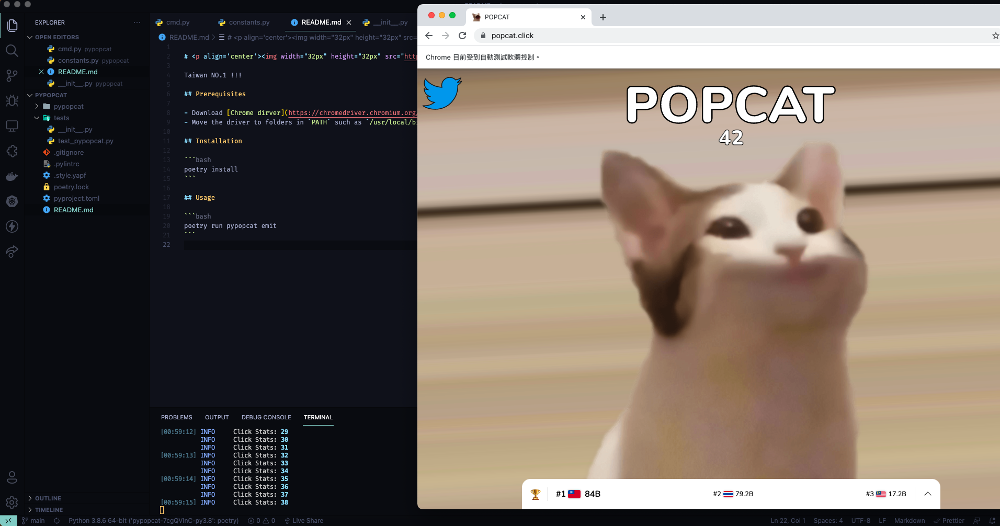

# <p align='center'>PyPopcat</p>

Taiwan NO.1 !!!

## Screenshots



## Prerequisites

- Download [Chrome dirver](https://chromedriver.chromium.org/)
- Move the driver to folders in `PATH` such as `/usr/local/bin`, `/usr/bin`.

## Installation

```bash
poetry install
```

## Usage

```bash
poetry run pypopcat emit
```
