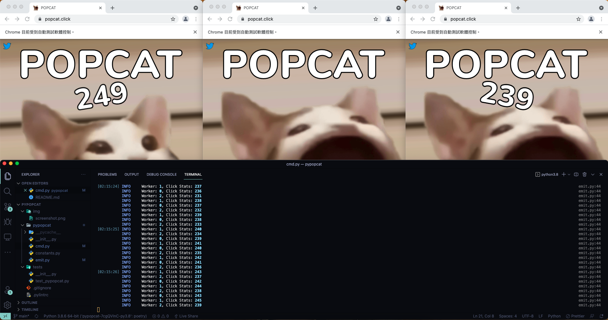

# <p align='center'>PyPopcat</p>

Taiwan NO.1 !!!

## Features

- Drive multiple Chrome windows to click by multithreading.
- Use HAProxy + TOR to prevent to be blocked by API rate limit

## Screenshots




## Prerequisites

- Download [Chrome driver](https://chromedriver.chromium.org/) based on your OS.
- Move the driver to folders in `PATH` such as `/usr/local/bin`, `/usr/bin`.

## Installation

```bash
poetry install
```

## Usage

```bash
poetry run pypopcat emit --n_threads 1 --country TW
```

### Use proxy

Open haproxy service by docker

```bash
docker run -d -p 5566:5566 -p 4444:4444 --env tors=25 mattes/rotating-proxy
```

And run command to pop clicks by selenium

```bash
poetry run pypopcat emit --n_threads 5 --country TW --proxy_server=http://localhost:5566
```

## Notes

According to popcat's rules, you can't exceed 800 clicks every 30s. You need to adjust `n_threads` due to worker's pps.
